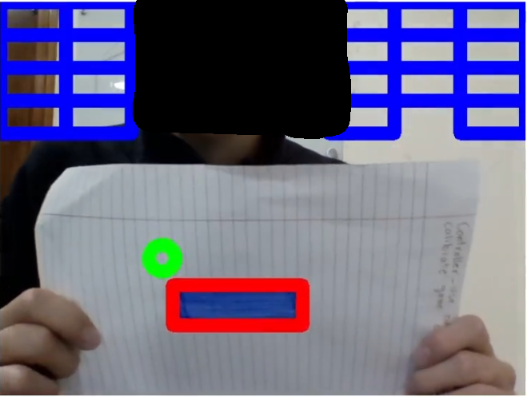

# OpenCV Test Game (OpenCV Breakout)
This project is based on the code at https://github.com/NakulLakhotia/Live-Streaming-using-OpenCV-Flask

Forked from https://github.com/joshbressers/opencv-object-detection

This is a quick game made in Python that I made to test my knowledge of OpenCV for my robotics team.

The code that I implemented likely isn't the best (it's been a while since I've programmed in
Python) so if you are from my robotics team and absolutely want to clean up the code, please
submit a pull request to fix any bugs or clean up any code.

The game is fairly buggy at times and I've only tested it on a Linux computer. However, it still
demonstrates how OpenCV can be used to process images/video and how the data can be used in
applications.

The idea is that you hit a ball around with a paddle that is moved around by detecting an object
of a certain color. It's a fairly simple breakout clone with the twist that you control the paddle
with a video camera.

## Usage

You should run this app using a Python virtual environment
```
python3 -m venv .venv
source .venv/bin/activate
pip install -r requirements.txt
python app.py
```

When you run the app it will print out the URL to access it

## How to use

### [Reference](https://blog.miguelgrinberg.com/post/video-streaming-with-flask)

To make the camera actually be able to tell where the "paddle" is supposed to be, take an object
(I recommend drawing a single colored object on a sheet of white paper and then scanning the
drawing's color with the color picker works quite well) and scan its color using the color picker.
Then move that object around and try to hit the ball to make it bounce around and avoid having the
ball fall off the edge of the screen.

Note: moving the object away from the camera reduces the paddle size while moving the object towards
the camera increases its size so use that knowledge to your advantage when playing.

## Screenshot


